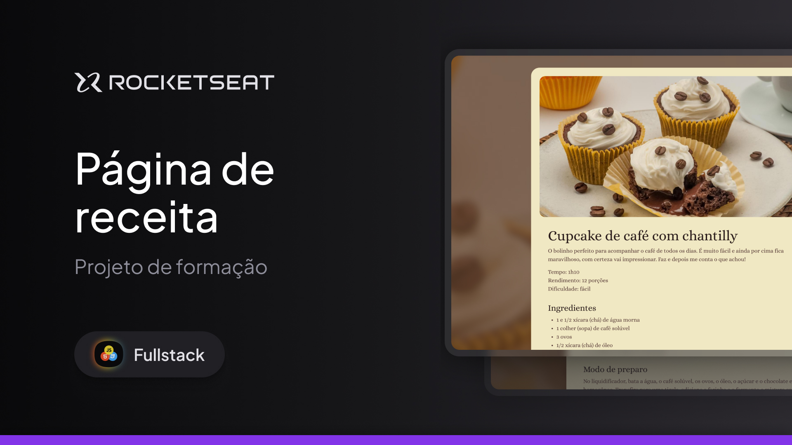

<h1 aling="center">Página de receita - Rocketseat - Full-Stack</h1>

Projeto feito no curso Full-Stack da Rocketseat

  

## Tecnologias

Esse projeto foi desenvolvido com as seguintes tecnologias

- HTML
- CSS

## Projeto

O projeto é uma Página de Receita de Cupcake de café com chantilly.
